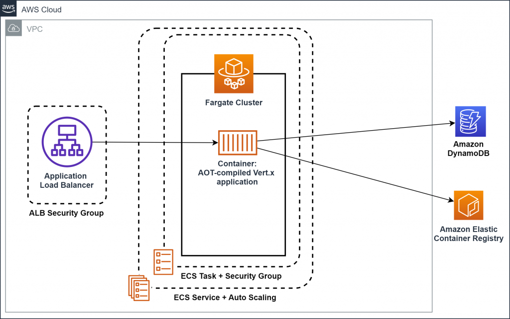

<!-- Improved compatibility of back to top link: See: https://github.com/othneildrew/Best-README-Template/pull/73 -->
<a name="readme-top"></a>


<!-- ABOUT THE PROJECT -->
## About The Project

This is my second project on Amazon Web Services. It aims at integrating dynamo db into the php webapp using the amazon SDK.
The base code was succesively forked from a git repository and then modified.

### Collaborations
I give credit to the following people from who's project was cloned and modified to mine. I am highly grateful for their effort and commitment to the project.
 1. William Mukoyani [@their_linkedin](https://www.linkedin.com/in/william-j-mukoyani)
 2. Esther Awudu [@their_linkedin](https://www.linkedin.com/in/esther-awudu-33690320b/)
 3. Thelma Laryea [@their_linkedin](https://www.linkedin.com/in/thelma-laryea-73a49b1b4/)
 4. Sampson Boamah [@their_linkedin](https://www.linkedin.com/in/sampson-boamah-b3629a114/)
##
### Project Overview
```
1. Create a table in dynamoDb
2. Clone the code from the repository
3. Pull the image from docker hub and run the image into a container on local host
```

##
```sh
   1. Creating an dynamoDb through the AWS console
```
You need to have a an AWS account, you can get a freetire account which basically means you get a free 1 year to use some AWS resources. In our case, we have that setup and we will be using the dynamoDb.
* Go to the dynamoDb service
* Click on "create table" :  a table is where we will put our items which coantain all your data.
* Click on "add items" : items are your individual data you input into you table.
##
```sh
   2. Clone the code from the repository
```
Cloning the code copies all the basix codes onto your local machine for you to be able access and work on.
* Go to [the repository of this project](https://github.com/PabloJermin/AWSProject2)
* Click on `<>Code`
* Copy the HTTPS link provided from the dropdown.
* Paste the copied link into your console preceeding with a `git pull` command like so :
   ```
   git pull https://github.com/PabloJermin/AWSProject2.git
   ```
##
```sh
   3. Pull the image from dockerhub and run it into a container
```
The application has already been containerized and hosted on docker hub. All we need to do is to pull it onto our local directory and run it.
* Sign in to docker hub and run your docker desktop.
* Go to the docker hub and search `donpee/guestbookphp`
* Pull the image by typing the following code in your console.
   ```
   docker pull donpee/guestbookphp
   ```
* When the image has successfully been plled, run the image into a container using 
   ```
      docker run -d -p 80:80 donpee/gurstbookphp 
   ```
* Now open your browser and type `localhost:80`. Your webapp should show on your browser


## Showcase a simple Architecture diagram
<!-- setup a link to your images folder -->
<a href="[https://github.com/lawrencemuema/Cloud_project02](https://github.com/lawrencemuema/Cloud_project02/blob/main/images/fargate_arch.png)">
    
</a>

<p align="right">(<a href="#readme-top">back to top</a>)</p>


<!-- CONTACT -->
## Contact

 Linkedin: [https://www.linkedin.com/in/jermin-amarteifio/](https://www.linkedin.com/in/jermin-amarteifio/)

Project Link: [https://github.com/PabloJermin/AWSProject2.git](https://github.com/PabloJermin/AWSProject2.git)

<p align="right">(<a href="#readme-top">back to top</a>)</p>


<!-- References -->
## References

The  follwing websites and resuorces were use during my project.

* [Github Readme Documentation](https://docs.github.com/en/get-started/writing-on-github)
* [Docker Documentation](https://docs.docker.com/)
* [AWS DynamoDb documentation](https://docs.aws.amazon.com/dynamodb/)

<p align="right">(<a href="#readme-top">back to top</a>)</p>
